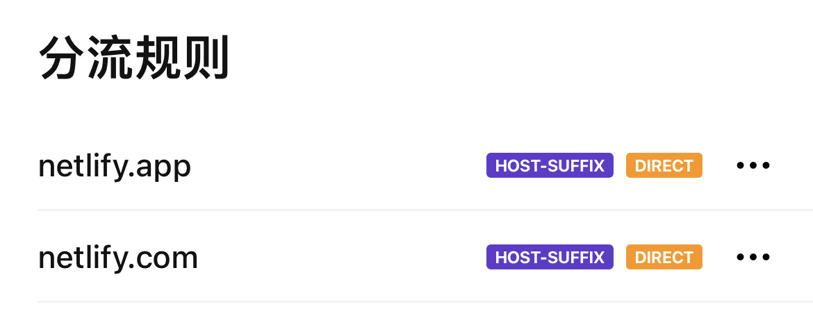
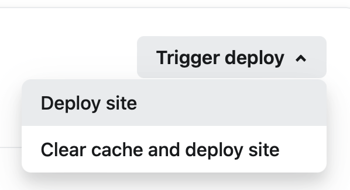
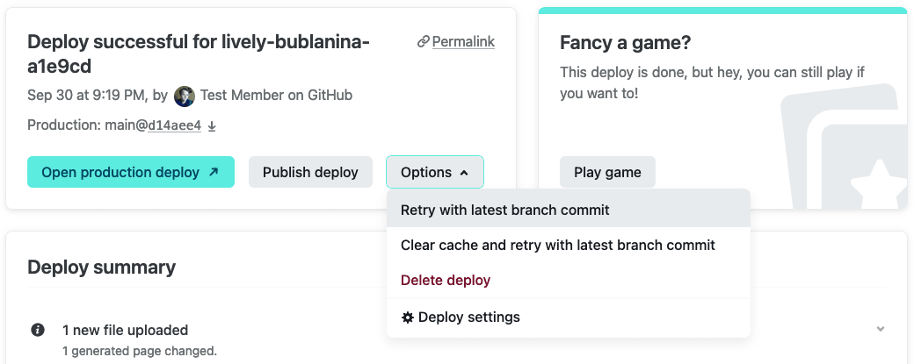

# 搭建ChatGPT、Gemini、通义千问、Kimi、Claude3 反向代理
only for 微信助手，突破gemini对区域的限制

欢迎来到微信助手 ChatGPT 反向代理项目！这个仓库帮助你部署 ChatGPT / Gemini-pro / 通义千问 / Kimi / Claude3 反向代理，使其能够与懒猫的微信助手插件的 ChatGPT 功能协同工作。

直接把微信助手的反代部署到Netlify！！！
这个方案独立的，不需要用到Cloudflare即可实现3种AI模型的代理，同时没有gemini的区域限制（User location is not supported for the API use）。

## Fork 仓库

1. 注册一个你自己的GitHub账户。
2. 来到我这个仓库，点击仓库右上角的 "Fork" 按钮，创建你自己的分支。

## 部署到 Netlify
【请留意以下每一个字】
1. 用邮箱注册[Netlify 帐号](https://app.netlify.com/signup/)。 
注意： 
1.1 Github授权登录的方式可能会引起身份审核； 
1.2 邮箱注册也有可能引起身份审核，尝试换邮箱地址，比如国外的邮箱； 
1.3 netlify.com和netlify.app的分流规则，建议设置为直连，不用魔法。 
 
2. 在 [Netlify](https://app.netlify.com) 上创建一个新Site(Add new site)。 
3. 点击弹出的窗口 "Import an existing project" 。 
4. Deploy with GitHub. 
5. 按提示授权 GitHub 到你的 Netlify。 
6. 选择你刚刚fork的项目 
7. "Add environment variables" 创建<B>WXID_ARRAY</B>这个环境变量（只创建一个，别重复），values值为：微信ID1,微信ID2,微信ID3  
---替换为你需要授权的微信ID，不同的ID需要用英文逗号隔开,最后一个微信ID后面不要加逗号。不需要加引号；  
---如果你的微信ID是wxid_abcdefg,你就填写wxid_abcdefg,别删掉了'wxid_';  
---如果你的微信ID是lambous就填写lambous、开头别加‘wxid’！  
---以此类推可以添加很多不止三个的。比如 wxid_abcdefg,lambous,yourxxx,abdcedf  
8. Deploy AiChatHelper
9. 等待部署完成，你将获得一个二级域名，这就是你的代理地址，记住它。（xxx.netlify.app；xxx可自定义，需要带上前缀https&#58;&#47;&#47;）
10. 以后在GitHub修改你的代码，Netlity会自动更新代码并重新部署。
11. 第7步的环境变量WXID_ARRAY是在初次部署之前填写的。如果部署成功后再次修改环境变量WXID_ARRAY的值，请重新部署。

## 使用方法
以下操作都是在“微信助手”ChatGPT中操作：
1. 将你的代理地址填写到“代理地址”栏。（https&#58;&#47;&#47;xxx.netlify.app）
2. 如果使用的是ChatGPT API，请在 “APIKey”中填写ChatGPT(Openai)的API Key，在“模型”中选择对应的<B>gpt-4</B>或者<B>gpt-3.5-turbo</B>。
3. 如果使用的是Gemini-pro API，请在 “APIKey”中填写Gemini-pro的API Key，在“模型”中选择 手动输入 ，填写：<B>Gemini-pro</B> (或填写简称Gemini)。
4. 如果使用的是通义千问 API，请在 “APIKey”中填写Qwen的API Key，在“模型”中选择 手动输入 ，填写：<B>qwen-turbo</B>或<B>qwen-max</B>。
5. 如果使用的是Moonshot Kimi API，请在 “APIKey”中填写Kimi的API Key，在“模型”中选择 手动输入 ，填写：<B>moonshot-v1-8k</B>或<B>moonshot-v1-32k</B>（微信文本长度应该不支持moonshot-v1-128k的长度，所以没写进去）。【Kimi的API申请https://login.moonshot.cn/】
6. 如果使用的是Claude3 API，请在 “APIKey”中填写Claude3的API Key，在“模型”中选择 手动输入 ，填写：<B>claude-3-opus-20240229</B>

## 其他事项
- 部分代码参考了懒猫提供的Gemini.zip，[懒猫插件交流](https://t.me/maogroup)
- 部分代码参考了Simon's Blog：[simonmy.com](https://simonmy.com/posts/使用netlify反向代理google-palm-api.html)
- 如果遇到任何问题，请参考[Netlify 文档](https://docs.netlify.com)进行故障排除。
- 有关微信助手ChatGPT相关功能使用，请查看微信助手中的详细使用说明，或者在交流群里交流。

祝你在微信助手中体验愉快！
# 其他方案都不需要看了，就用此方案可以了。
